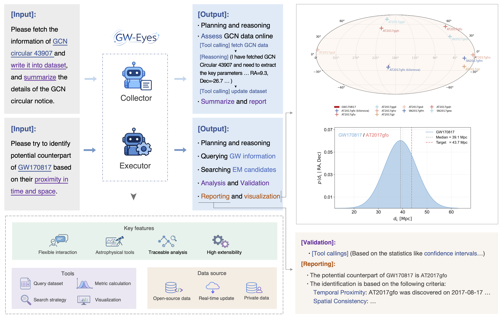

<p align="center">
    
</p>

<h3 align="center">
<b>GW-Eyes: An agentic framework for gravitational-wave counterpart association in the multi-messenger era</b>
<br>
</h3>

----
## Overview

GW-Eyes is an agentic system designed for GW counterpart association. It consists of two sub-agents, Collector and Executor, and integrates domain-specific tools through the Model Context Protocol (MCP). GW-Eyes is capable of autonomously performing counterpart association tasks between GW events and candidate EM events. In addition, it supports natural language interaction to assist human experts with auxiliary tasks such as catalog updates, skymap visualization, and rapid verification. GW-Eyes is also highly extensible, as more specialized criteria can be readily incorporated by extending the agent’s toolset.

<p align="center">
    
</p>


## Quick start

### 1. Install the dependencies

```bash
conda create -n GWEyes python=3.10
conda activate GWEyes
pip install -r requirements.txt
```

### 2. Set the LLM API

```bash
export LLM__API_KEY=YOUR_API_KEY
export LLM_BASE_URL=YOUR_BASE_URL # like https://api.openai.com/v1
export LLM_ID=YOUR_MODEL_ID       # like gpt-5
```

### 3. Download the dataset

We need download the skymap of gravitational waves. To get started quickly, we will temporarily download only the skymap for GW170817. Besides we need to download the [Open Supernova Catalog](https://github.com/astrocatalogs/supernovae) as an example.

We can download data through GW-Eyes collector. Launch the collector agent (the first startup may be a bit slow).
```python
python -m GW_Eyes.src.run_agent --agent collector
```
You'll see `GW agent REPL. Type 'exit' or 'quit' to stop.` Now let's start to try:
```
Please download the skymap of GW170817 and the Open Supernova Catalog for me, thanks.
```
Type `exit` or `quit` to stop the agent loop.

Or you can download the dataset through:
```python
python -m recipe.download_gw_data.download_GWTC_skymap --catalogs gw170817
python -m recipe.download_osc_data.download_osc_catalog
```

### 4. Run GW-Eyes

After everything is ready, launch the executor agent.
```python
python -m GW_Eyes.src.run_agent 
```
Try:
```
Show the skymap of gravitational-wave event GW170817 for me, thanks.
```
```
Please search for electromagnetic events that occurred near the time of GW170817 and show the skymap to see their spatial locations.
```
You can see GW-Eyes calling tools, generating final responses, and find the images it provides in `GW_Eyes/cache`. Since the LLM's tool calls and response generation take some time, please wait a moment. 

Finally, type `exit` or `quit` to stop the agent loop.

Please refer to the [documentation](./docs/documentation/README.md) for more use cases.

## Acknowledegement

We gratefully acknowledge the developers of the following libraries, which have been instrumental to this project, [agno](https://github.com/agno-agi/agno), [ligo.skymap](https://github.com/lpsinger/ligo.skymap), [pesummary](https://github.com/pesummary/pesummary), [pycbc](https://github.com/gwastro/pycbc). At the same time, we sincerely thank open-source databases such as [GWOSC](https://gwosc.org), the [Open Supernova Catalog](https://github.com/astrocatalogs/supernovae), and [AGN-Flares](https://github.com/Lyle0831/AGN-Flares).

If you have any questions, please open an issue or contact the authors.